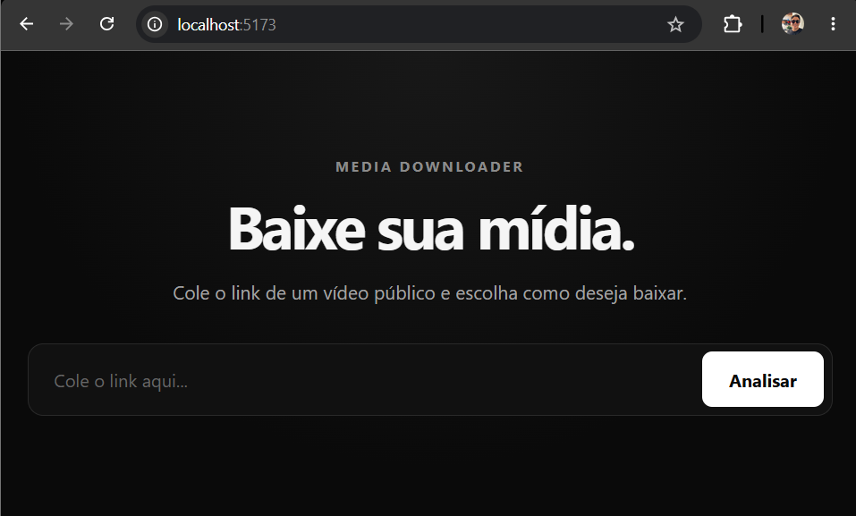
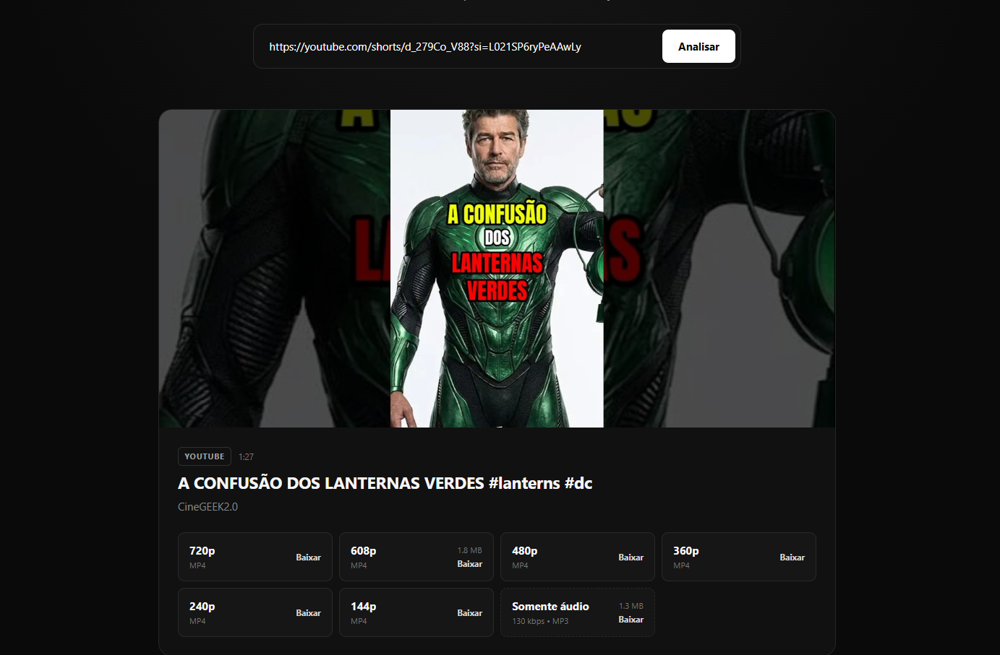

# Media Downloader

Aplicação web para análise e download de mídias públicas, com suporte a diferentes qualidades de vídeo e extração de áudio em MP3.

O projeto possui frontend em **React + TypeScript** e uma API em **FastAPI**, utilizando **yt-dlp** para extração de metadados e formatos e **FFmpeg** para mesclagem de áudio/vídeo e conversão de áudio.

Todo o ambiente é executado com **Docker Compose**, sem necessidade de instalar Python, FFmpeg ou as dependências do backend diretamente na máquina.

## Screenshots

### Tela inicial



### Análise de mídia



## Funcionalidades

* Análise de URLs antes do download
* Exibição de título, thumbnail, duração, autor e plataforma
* Identificação automática dos formatos disponíveis
* Seleção de qualidade de vídeo
* Download de vídeo com áudio
* Mesclagem automática de streams separados com FFmpeg
* Extração e conversão de áudio para MP3
* Estimativa de tamanho dos formatos quando disponível
* Validação de URLs e tratamento de mídias indisponíveis
* Limpeza automática dos arquivos temporários após o download
* Testes automatizados dos principais comportamentos do backend

## Plataformas testadas

| Plataforma | Status                                       |
| ---------- | -------------------------------------------- |
| YouTube    | Suportado                                    |
| Instagram  | Suportado para mídias públicas acessíveis    |
| TikTok     | Experimental / pode apresentar instabilidade |
| Threads    | Não suportado atualmente                     |

O suporte depende dos extratores disponibilizados pelo **yt-dlp** e das regras de acesso de cada plataforma. Conteúdos privados, protegidos por login ou que exijam cookies podem não funcionar.

## Stack

### Frontend

* React
* TypeScript
* Vite
* CSS

### Backend

* Python
* FastAPI
* Pydantic
* yt-dlp
* FFmpeg

### Infraestrutura e testes

* Docker
* Docker Compose
* pytest
* httpx

## Arquitetura

O projeto é dividido em dois serviços independentes:

```text
┌─────────────────────────┐
│        Frontend         │
│   React + TypeScript    │
│      Vite :5173         │
└────────────┬────────────┘
             │ HTTP
             ▼
┌─────────────────────────┐
│         Backend         │
│    FastAPI :8000        │
└────────────┬────────────┘
             │
             ▼
         yt-dlp
        ┌────┴─────┐
        │          │
        ▼          ▼
  Metadados     Download
                   │
                   ▼
                 FFmpeg
              ┌────┴────┐
              │         │
              ▼         ▼
         Merge A/V     MP3
```

Ao analisar uma URL, o backend utiliza o **yt-dlp** sem realizar o download da mídia. Os dados retornados são normalizados antes de serem enviados ao frontend, evitando expor ao usuário uma lista excessiva de formatos técnicos equivalentes.

No download, o formato selecionado é validado novamente. Quando vídeo e áudio são fornecidos separadamente pela plataforma, o yt-dlp utiliza o **FFmpeg** para combiná-los. Para downloads somente de áudio, o FFmpeg converte o stream selecionado para **MP3**.

Os arquivos são processados em diretórios temporários no backend e removidos automaticamente após o envio da resposta.

## Estrutura

```text
media-downloader/
├── backend/
├── frontend/
├── docs/
├── docker-compose.yml
└── README.md
```

## Executando localmente

### Pré-requisitos

* Docker
* Docker Compose

Clone o repositório:

```bash
git clone https://github.com/DanielMeirelesSi/Media-downloader.git
cd Media-downloader
```

Suba os serviços:

```bash
docker compose up --build
```

A aplicação estará disponível em:

```text
http://localhost:5173
```

API:

```text
http://localhost:8000
```

Swagger / documentação da API:

```text
http://localhost:8000/docs
```

Para encerrar os containers:

```bash
docker compose down
```

## Configuração

As configurações disponíveis estão documentadas no `.env.example`:

```env
VITE_API_URL=http://localhost:8000
CORS_ORIGINS=http://localhost:5173
```

O projeto possui valores padrão para desenvolvimento local e funciona mesmo sem a criação de um `.env`.

Caso seja necessário sobrescrever as configurações, crie um arquivo `.env` na raiz do projeto.

`VITE_API_URL` define o endereço utilizado pelo frontend para acessar a API.

`CORS_ORIGINS` define as origens permitidas pelo backend e aceita múltiplos valores separados por vírgula:

```env
CORS_ORIGINS=http://localhost:5173,http://127.0.0.1:5173
```

O arquivo `.env` é ignorado pelo Git.

## API

### `GET /health`

Verifica o estado da API.

```json
{
  "status": "ok"
}
```

### `POST /api/media/info`

Analisa uma URL sem realizar o download e retorna informações da mídia e os formatos disponíveis.

### `POST /api/media/download`

Recebe a URL e o formato selecionado, processa a mídia quando necessário e retorna o arquivo para download.

## Testes

O backend possui testes automatizados para os principais fluxos da aplicação.

Atualmente são testados:

* health check da API
* análise de mídia
* tratamento de erros dos endpoints
* erros durante downloads
* agrupamento de formatos por resolução
* preferência por MP4 entre formatos equivalentes
* identificação de formatos com e sem áudio
* seleção do melhor formato de áudio
* representação de áudio como MP3

Os testes utilizam mocks e não realizam requisições reais para plataformas externas.

Para executar:

```bash
docker compose run --rm backend sh -c "pip install --no-cache-dir -r requirements-dev.txt && pytest"
```

## Limitações conhecidas

* Apenas mídias públicas acessíveis pelo yt-dlp podem ser processadas
* Conteúdos que exigem login, cookies ou acesso privado podem falhar
* Alterações internas nas plataformas podem afetar temporariamente seus extratores
* O suporte ao TikTok ainda pode apresentar comportamento instável
* Threads não é suportado atualmente
* O tamanho informado antes do download é baseado nos metadados disponibilizados pela plataforma e pode diferir do arquivo final
* Downloads são processados temporariamente pelo backend antes de serem enviados ao navegador
* O projeto atualmente não possui autenticação, rate limiting, fila de processamento ou armazenamento persistente
